# 🏠 Smart Dormitory Manager | نظام ذكي لإدارة السكن الطلابي

نظام مكتبي متكامل صُمم لإعادة تعريف طريقة إدارة السكنات الجامعية، يجمع بين **الكفاءة الإدارية** و **المرونة التقنية**.  
تم تطويره باستخدام لغة #C وتقنيات Windows Forms، ويعتمد على بنية **3-Tier Architecture**، مع تطبيق فعّال لتقنيات **ADO.NET** للتعامل مع قواعد البيانات بأداء وموثوقية.

---

## 🎯 نبذة عن المشروع

يوفر هذا النظام منصة ذكية لإدارة السكن الطلابي بكافة تفاصيله — من بيانات الساكنين وحتى إدارة الموظفين والمصروفات الشهرية.  
يهدف إلى أتمتة العمليات اليومية وتقليل الجهد اليدوي، مع توفير واجهة سهلة الاستخدام وتجربة متكاملة للمستخدم.

---

## ✨ أهم المميزات

- تسجيل، تعديل، تتبع تسكين الطالب وتاريخه داخل السكن **📋**
- نظام موثوق لتسجيل مخالفات الطلاب مع إمكانية توليد تقارير دقيقة **📑**
- إضافة وتحديث بيانات طاقم العمل داخل السكن **🧑‍💼**
- نظام دخول متعدد المستويات بصلاحيات مخصصة لكل نوع مستخدم **🔐**
- حساب المصروفات والإيرادات، مع تقارير تحليلية مفصلة **📊**
- تنظيم ميزانية الطعام والشراب وتوزيعها حسب الحاجة **🍴**
- فصل تام بين الطبقات الثلاث (العرض - المنطق - البيانات) لسهولة الصيانة والتطوير **🏗️**
- التعامل المباشر مع قواعد البيانات باستخدام ADO.NET بأسلوب مرن وآمن **🧬**
- تحليل وتصدير البيانات بصيغة JSON باستخدام مكتبة Json.NET **🧾**

---

## 🧰 التقنيات المستخدمة

| الأداة / التقنية         | الاستخدام                                 |
|--------------------------|--------------------------------------------|
| 💻 C#                    | اللغة الأساسية لبناء النظام               |
| 🪟 Windows Forms         | تصميم الواجهة الرسومية                    |
| 🧱 3-Tier Architecture   | هيكلة الكود بشكل منظم وقابل للتوسعة        |
| 🛢️ SQL Server            | قاعدة البيانات المعتمدة                    |
| 🔄 ADO.NET               | إدارة الاتصال والاستعلامات مع قاعدة البيانات |
| 📦 Newtonsoft.Json       | تحليل وتنسيق بيانات JSON                  |

---

## 🖼️ صور من داخل النظام

| الشاشة | الوصف |
|--------|--------|
| 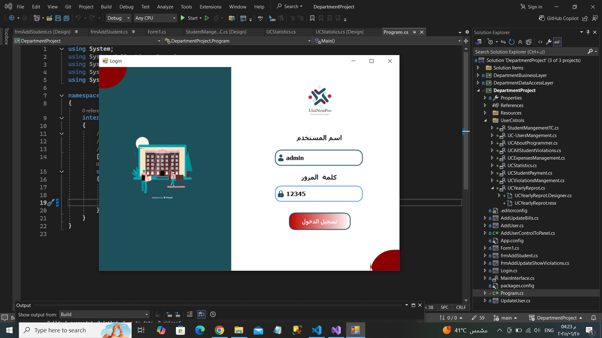 | شاشة الدخول للنظام |
| 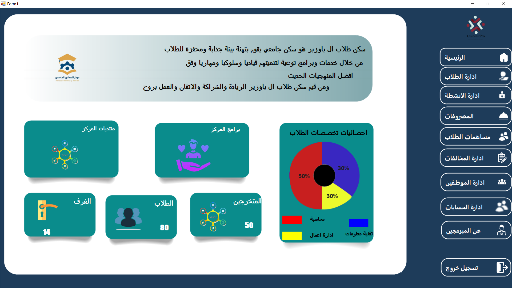 | شاشة  الرئيسية |
| 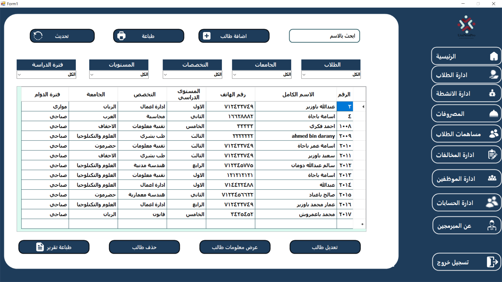 | عرض وإدارة بيانات الطلاب |
| 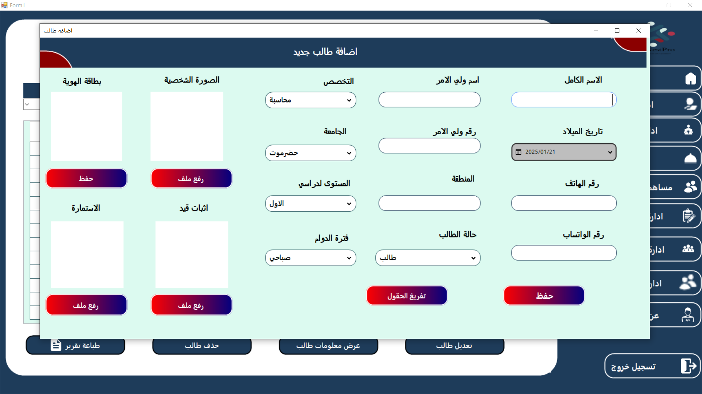 |   اضافة وحذ وتديل وعرض بيانات طالب |
| 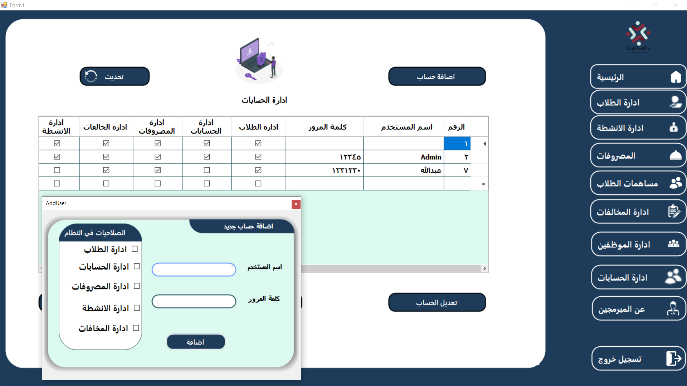 | إدارة حسابات المستخدمين |
| 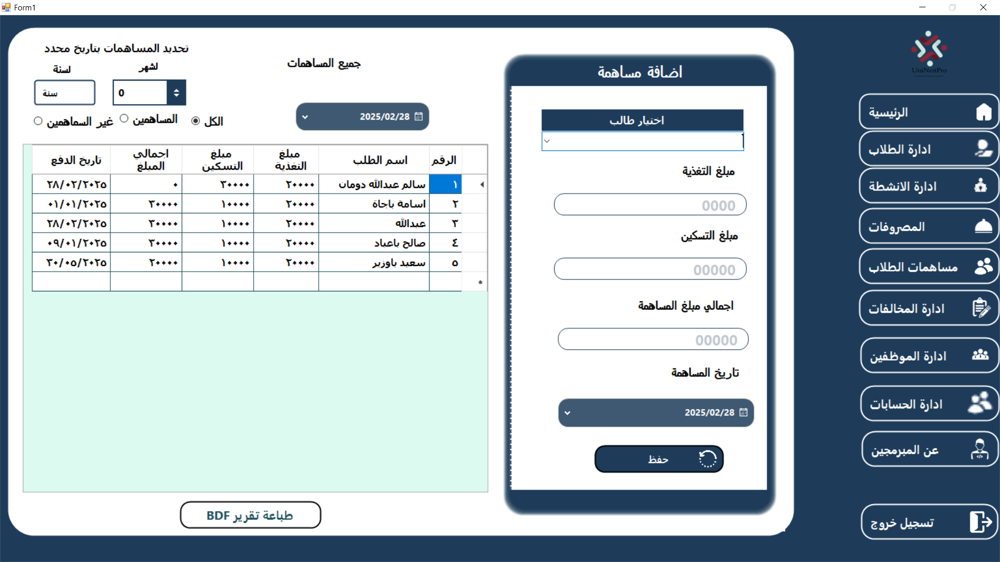 |   ادارة الدفوعات |
| 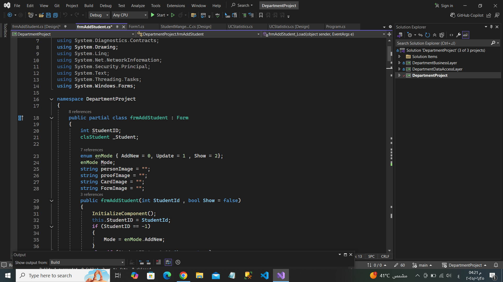 |   هيكل وتقسيم المشروع |
| 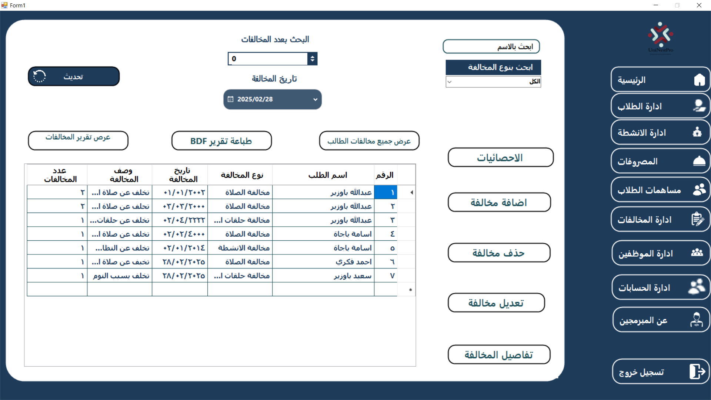 | تقارير وإدارة مخالفات |
| 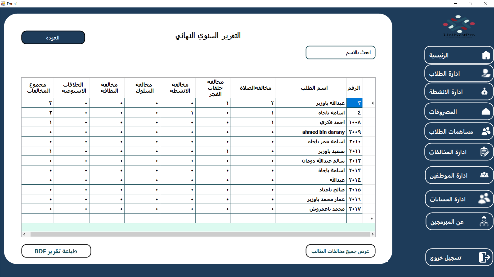 | احصائيات مخالفات جميع الطلاب |
| 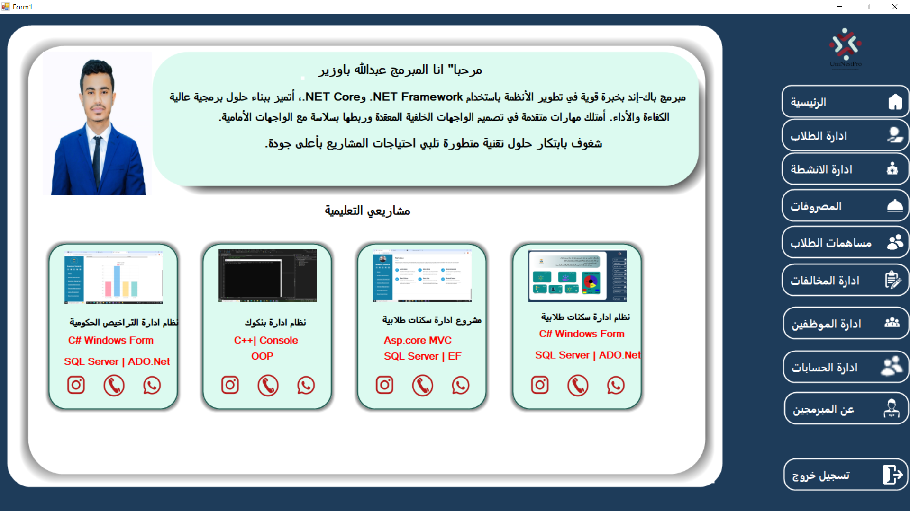 | نبذة عن المبرمج |
| 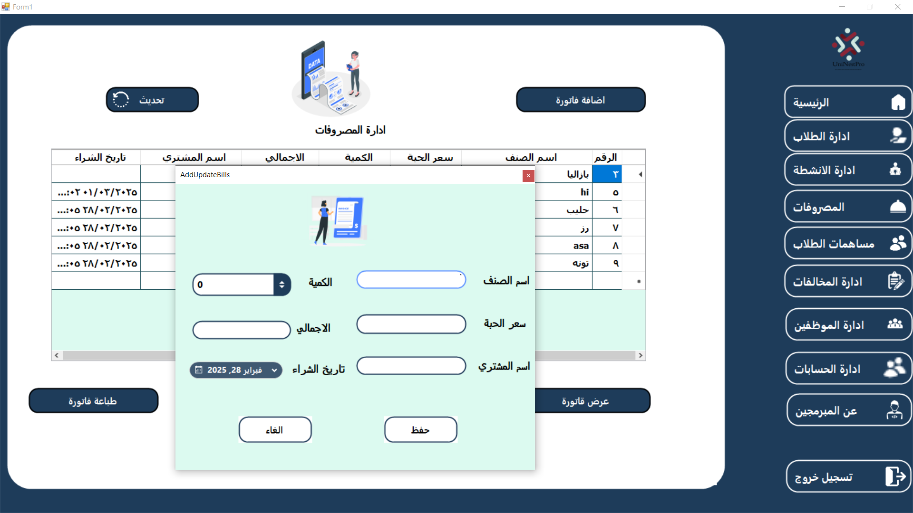 |   ادارة المصروفات |

---

## 🚀 خطوات التشغيل

1. حمّل المشروع من GitHub.
2. افتح الحل عبر Visual Studio.
3. اربط قاعدة البيانات المرفقة (ملف `.sql`) عبر SQL Server.
4. حدث سلسلة الاتصال في ملف الإعدادات إن لزم الأمر.
5. سجل الدخول باستخدام بيانات حساب المسؤول الموجودة في قاعدة البيانات.
6. ابدأ الاستخدام!

---

## ⭐ تواصل

هل أعجبك المشروع؟ ساهم بتقييمه 🌟  
هل لديك أفكار أو ملاحظات؟ تواصل معي وسأكون سعيدًا بسماعها! 📩  
